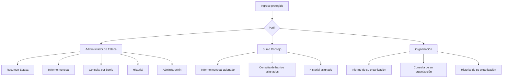
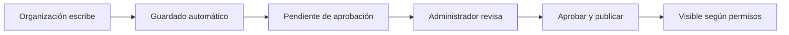

# Mapa de vistas — Informes Estaca Ñuñoa

## Permisos por perfil

| Vista | Administrador de Estaca | Sumo Consejo | Organización |
|---|---|---|---|
| Resumen Estaca | Todos los barrios | No | No |
| Ingreso de informe | Cualquier barrio | Barrios asignados | Su organización, por barrio |
| Consulta por barrio | Todo, incluidos pendientes | Informes del Sumo Consejo y aportes aprobados de sus barrios | Aportes aprobados de su organización en los barrios asignados |
| Historial | Informes y organizaciones | Información de sus barrios | Información de su organización |
| Aprobación y publicación | Sí | No | No |
| Barrios y usuarios | Sí | No | No |

## Flujo de publicación

Los aportes de organizaciones no aparecen a otros usuarios hasta ser aprobados. El administrador puede verlos y modificarlos antes de publicarlos.
